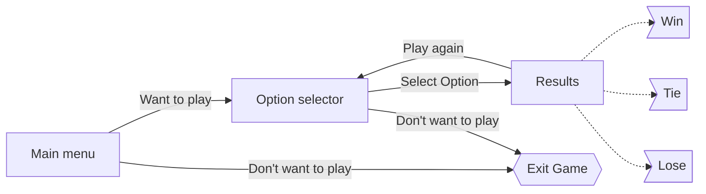

# Rock paper scissors
A simple rock paper scissors game made in :crab: Rust :crab: with the crates [Cursive](https://github.com/gyscos/cursive) and [Rand](https://github.com/rust-random/rand)

## Objectives
The objective of the project was to understand and learn to use [Cursive](https://github.com/gyscos/cursive)

## How was made
The project was made by adapting the Cursive tutorial to the needs of the projects

## App flow

## TODO
[] Load screen in before showing the results to give more excitement